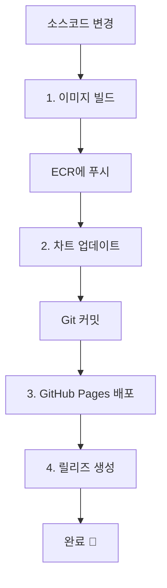

# NGINX Helm Chart with Sequential CI/CD Pipeline

AWS EKS에서 Blue/Green 배포를 위한 NGINX Helm 차트와 순차적으로 실행되는 GitHub Actions CI/CD 파이프라인입니다.

## 🚀 특징

- **자동 빌드**: 소스코드 변경 시 자동으로 이미지 빌드 및 배포
- **순차적 실행**: 4단계로 분리된 워크플로우가 순서대로 실행
- **Blue/Green 배포**: ECR의 blue/green 이미지 간 전환
- **AWS Load Balancer Controller**: ALB Ingress 지원
- **자동화된 CI/CD**: GitHub Actions를 통한 이미지 빌드 및 차트 업데이트
- **ArgoCD 연동**: GitOps 방식의 배포 자동화
- **ECR 통합**: 자동 이미지 빌드 및 ECR 업로드

## 🔄 순차적 워크플로우 구조

### 1단계: 🐳 이미지 빌드 (`1-build-image.yml`)
- **트리거**: `src/**`, `docker/**`, `helm/**`, `.github/workflows/**` 변경
- **작업**: Docker 이미지 빌드 → ECR 푸시 → 다음 워크플로우 트리거

### 2단계: 📝 차트 업데이트 (`2-update-chart.yml`)
- **트리거**: 1단계 완료 후 자동 실행
- **작업**: values.yaml 업데이트 → Chart.yaml 버전 업데이트 → 차트 패키징 → Git 커밋

### 3단계: 🌐 GitHub Pages 배포 (`3-deploy-pages.yml`)
- **트리거**: 2단계 완료 후 자동 실행
- **작업**: 패키징된 차트를 GitHub Pages에 배포

### 4단계: 🏷️ 릴리즈 생성 (`4-create-release.yml`)
- **트리거**: 3단계 완료 후 자동 실행
- **작업**: GitHub Release 생성 및 파이프라인 요약

## 📁 프로젝트 구조

```
onboarding/8th/helm/
├── .github/workflows/
│   ├── 1-build-image.yml       # 🐳 이미지 빌드 및 ECR 푸시
│   ├── 2-update-chart.yml      # 📝 Helm 차트 업데이트
│   ├── 3-deploy-pages.yml      # 🌐 GitHub Pages 배포
│   └── 4-create-release.yml    # 🏷️ GitHub Release 생성
├── src/
│   └── index.html              # 웹 페이지 소스코드
├── nginx/                      # Helm 차트
│   ├── Chart.yaml
│   ├── values.yaml
│   └── templates/
├── dist/                       # 패키징된 차트 (GitHub Pages)
├── .git/                       # Git 저장소
└── README.md
```

## 🔄 자동 실행 플로우



### 자동 버전 관리

**Push 이벤트 시 자동 설정:**
- **Image Type**: `blue` (기본값)
- **Chart Version**: `1.YYYYMMDD.HHMM` (타임스탬프 기반)
- **Image Tag**: Git 커밋 해시 (짧은 형태)

**예시:** `1.20241201.1430` (2024년 12월 1일 14:30에 빌드)

## 📦 포함된 리소스

- Deployment (Blue/Green 이미지 지원)
- Service (ClusterIP)
- Ingress (AWS ALB)
- ServiceAccount
- Secret
- PersistentVolumeClaim
- HorizontalPodAutoscaler (HPA)
- PodDisruptionBudget (PDB)

## ⚙️ 사전 설정

### GitHub Settings 설정

**1. GitHub Secrets 설정**

Repository Settings → Secrets and variables → Actions에서 다음 시크릿을 추가하세요:

```
AWS_ACCESS_KEY_ID: <your-aws-access-key-id>
AWS_SECRET_ACCESS_KEY: <your-aws-secret-access-key>
```

**2. GitHub Pages 설정**

Repository Settings → Pages에서:
- **Source**: GitHub Actions
- **Custom domain**: (선택사항)

### AWS IAM 권한

GitHub Actions에서 사용할 IAM 사용자에게 다음 권한이 필요합니다:

```json
{
    "Version": "2012-10-17",
    "Statement": [
        {
            "Effect": "Allow",
            "Action": [
                "ecr:GetAuthorizationToken",
                "ecr:BatchCheckLayerAvailability",
                "ecr:GetDownloadUrlForLayer",
                "ecr:BatchGetImage",
                "ecr:DescribeRepositories",
                "ecr:CreateRepository",
                "ecr:InitiateLayerUpload",
                "ecr:UploadLayerPart",
                "ecr:CompleteLayerUpload",
                "ecr:PutImage"
            ],
            "Resource": "*"
        }
    ]
}
```

## 🔧 사용 방법

### 1. 자동 배포 (권장)

**소스코드 변경:**
```bash
# 1. 소스코드 수정
echo '<h1>Updated Content v2.0</h1>' >> src/index.html

# 2. 변경사항 커밋 및 푸시
git add src/index.html
git commit -m "feat: Update homepage content to v2.0"
git push origin main

# 3. 순차적으로 4개 워크플로우가 자동 실행됨:
#    1-build-image → 2-update-chart → 3-deploy-pages → 4-create-release
```

**자동 실행 결과:**
- 🐳 새 이미지가 ECR에 자동 업로드
- 📝 Helm 차트가 새 버전으로 업데이트
- 🌐 GitHub Pages에 차트 저장소 자동 배포
- 🏷️ GitHub Release 자동 생성

### 2. 수동 실행

각 워크플로우를 개별적으로 수동 실행할 수도 있습니다:

**1단계 수동 실행:**
- GitHub Repository → Actions → "1. Build and Push Docker Image"
- `image_type`: blue/green 선택
- `image_tag`: 원하는 태그 입력

### 3. 수동 설치

**Helm 저장소 추가:**
```bash
helm repo add my-nginx https://bcgee.github.io/helm-nginx/
helm repo update my-nginx
```

**차트 설치:**
```bash
helm upgrade --install my-nginx my-nginx/nginx \
  --version 1.1.6 \
  --namespace production \
  --create-namespace
```

## 🖼️ 컨테이너 이미지

### 자동 빌드 이미지
```
319867767576.dkr.ecr.ap-northeast-2.amazonaws.com/nginx-blue:<commit-hash>
```

### Blue 이미지 (수동)
```
319867767576.dkr.ecr.ap-northeast-2.amazonaws.com/nginx-blue:latest
```

### Green 이미지 (수동)
```
319867767576.dkr.ecr.ap-northeast-2.amazonaws.com/nginx-green:latest
```

## 📝 워크플로우 실행 예시

### 새 기능 개발 및 자동 배포

1. **소스코드 수정:**
   ```bash
   # src/index.html 파일 수정
   vim src/index.html
   
   # 변경사항 커밋
   git add src/index.html
   git commit -m "feat: Add new navigation menu"
   git push origin main
   ```

2. **자동 실행 과정:**
   - ✅ **1단계**: Docker 이미지 빌드 → ECR 푸시 (3-5분)
   - ✅ **2단계**: 차트 업데이트 → Git 커밋 (1-2분)
   - ✅ **3단계**: GitHub Pages 배포 (1-2분)
   - ✅ **4단계**: Release 생성 (30초)

3. **결과:**
   - 새 이미지: `nginx-blue:<commit-hash>`
   - 새 차트 버전: `1.20241201.1430`
   - GitHub Release 자동 생성
   - GitHub Pages 차트 저장소 갱신

### Blue → Green 수동 배포

1. **Green 이미지 빌드:**
   - Workflow: "1. Build and Push Docker Image" 수동 실행
   - image_type: `green`
   - image_tag: `v2.0.0`

2. **자동 연쇄 실행:**
   - 2→3→4단계가 순차적으로 자동 실행

### 롤백

```bash
helm rollback my-nginx 1 -n production
```

## 🔍 모니터링

### 워크플로우 실행 상태 확인

GitHub Repository → **Actions** 탭에서 각 워크플로우의 실행 상태를 확인할 수 있습니다:

- 🟢 성공: 모든 단계 완료
- 🟡 진행중: 현재 실행 중인 단계
- 🔴 실패: 오류 발생 (로그 확인 필요)

### 배포 상태 확인

```bash
# Helm 릴리즈 확인
helm list -n production

# Pod 상태 확인
kubectl get pods -n production -l app=nginx

# Ingress 확인
kubectl get ingress -n production
```

### 로그 확인

```bash
kubectl logs -n production -l app=nginx -f
```

## 🛠️ 개발

### 로컬 테스트

```bash
# 템플릿 렌더링 테스트
helm template my-nginx ./nginx --values ./nginx/values.yaml

# Dry-run 테스트
helm install my-nginx ./nginx --dry-run --debug
```

### 로컬 이미지 빌드

```bash
# 소스코드 기반 빌드
docker build -t nginx-source:local -f docker-build/Dockerfile .

# Blue 이미지 빌드
docker build -t nginx-blue:local -f docker-build/Dockerfile .
```

### 차트 패키징

```bash
helm package nginx -d dist
helm repo index dist --url https://bcgee.github.io/helm-nginx/
```

## 🚨 트러블슈팅

### 워크플로우 실패 시

1. **이미지 빌드 실패**: AWS 자격 증명 확인
2. **차트 업데이트 실패**: Helm 차트 문법 확인
3. **Pages 배포 실패**: GitHub Pages 설정 확인
4. **Release 생성 실패**: 중복 태그명 확인

### 자주 발생하는 문제

- **ECR 권한 오류**: IAM 정책 확인
- **파일 경로 오류**: 상대 경로 확인
- **워크플로우 트리거 오류**: 파일명 정확성 확인

## 📋 요구사항

- Kubernetes 1.20+
- Helm 3.8+
- AWS Load Balancer Controller
- ArgoCD (선택사항)
- AWS ECR 접근 권한

## 🤝 기여

1. Fork the repository
2. Create a feature branch
3. Commit your changes
4. Push to the branch
5. Create a Pull Request

## 📄 라이선스

MIT License 